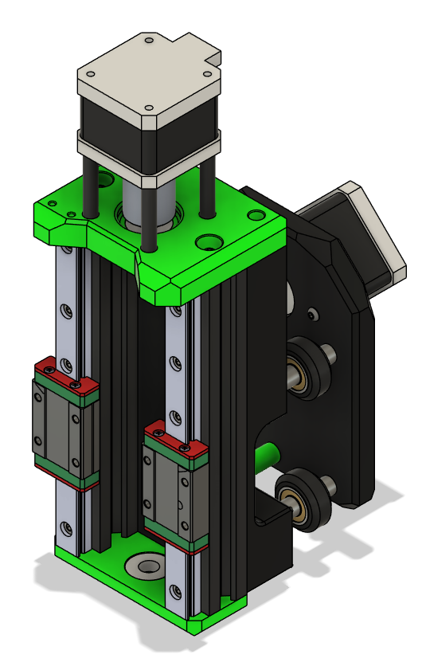
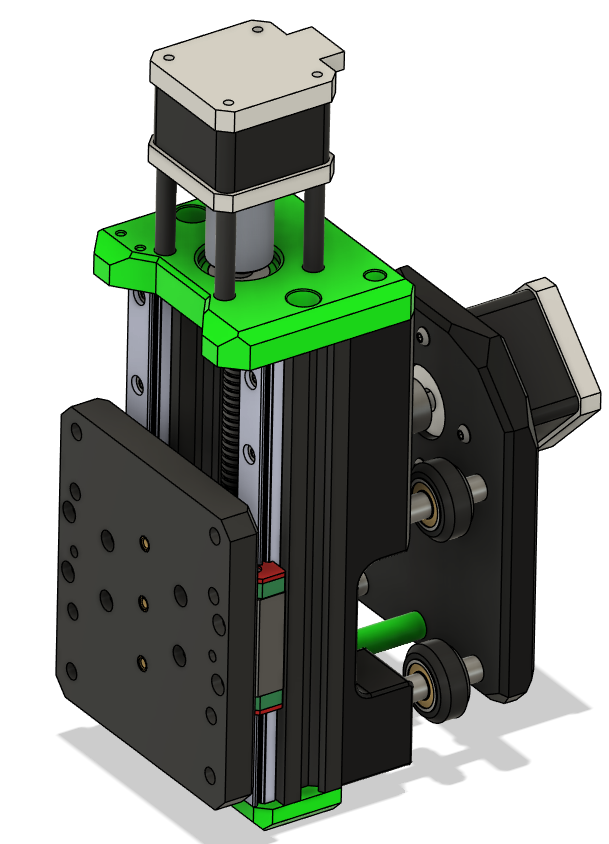
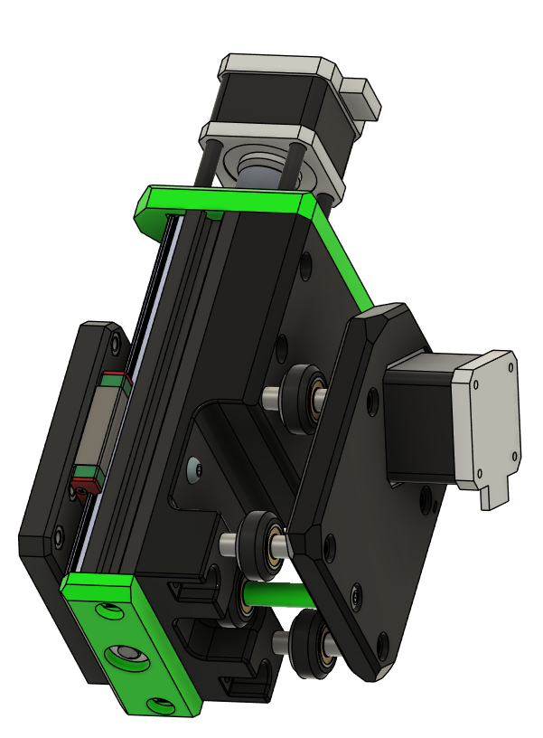
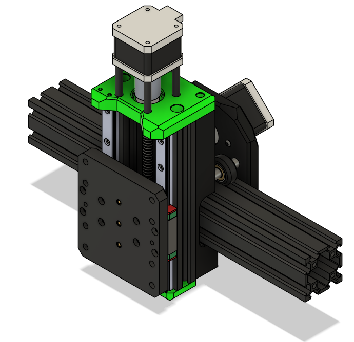

# Carriage Assembly

This chapter covers assembling the carriage, mounting motors, bearings, and spacers.

---

## 1. Parts Required

| Qty   | Item                    | Source   | Notes                        |
|-------|-------------------------|----------|------------------------------|
| 4pc   | M3x8 BHSC               | Ender3   |                              |
| 2pc   | M3x10                   | Buy      |                              |
| 10pc  | M5x16 BHSC              | Buy      |                              |
| 2pc   | M5x8 BHSC               | Ender3   |                              |
| 4pc   | M3x40                   | Ender3   |                              |
| 4pc   | M5x45 SHSC              | Ender3   | Remove shims                 |
| 1pc   | M5x65 BHSC              | Buy      |                              |
| 12pc  | M3x8 SHSC               | Buy      |                              |
| 2pc   | M3x16 BHSC              | Ender3   |                              |
| 9pc   | Aluminum Spacers        | Ender3   |                              |
| 1pc   | 28.35mm Printed Spacer  | Printed  |                              |
| 5pc   | V-Wheels                | Ender3   |                              |
| 4pc   | 32.60mm Printed Spacer  | Printed  |                              |
| 8pc   | M3x10 BHSC              | Ender3   |                              |

---

## 2. Safety Notes

!!! warning
    Do **not press in the endstops** until wiring is complete.  
    Press-fit endstops can be very difficult to remove if installed too early.

---

## 3. Assemble the X+Z Carriage

1. Cut Ender3 2020 extrusions to 150mm x2.  
2. Tap M5 threads in **both ends** of the 150mm extrusions.  
3. Press in bearings if not already done.  
4. Loosely attach:
   - Z motor coupler
   - X motor pulley (20T)
5. Attach both motors to their plates.  
6. Assemble the 2020 extrusions as square and parallel as possible.  
7. Mount the X motor carriage to the ZX carriage with wheels and spacers.  
8. Attach the Z bottom bearing plate and Z motor plate.  
9. Mount the MGN12 rails with carriages to the 2020 extrusions:
   - Use a printed **MGN12->2020 alignment tool** to ensure straight rails.  
   - Rails can slide into cutouts if slightly too long (max 4mm overhang).  
10. Attach Z leadscrew nut to Z carriage.  
11. Mount Z carriage to MGN12H carriages:
    - Slide up and down to check for binding. Adjust rails if necessary.  
12. Cut leadscrew to size (~180mm), double-check with your setup.  
13. Screw leadscrew from bottom bearing to Z motor coupler and secure.  
14. Slide the X+Z assembly on the previously cut X extrusion.

!!! tip
    Ender3 aluminum spacers are 8.35mm. If using 8mm spacers from another source, use the **printed lower middle spacer** to maintain alignment.

---
    
## Ready to Proceed?

After completing these steps, your **Carriage Assembly is ready for Ganty installation**.

  <a href="/EnderCNC/gantry" class="md-button md-button--primary">
    Continue to Mounting Carriage on the Gantry  →
  </a>

