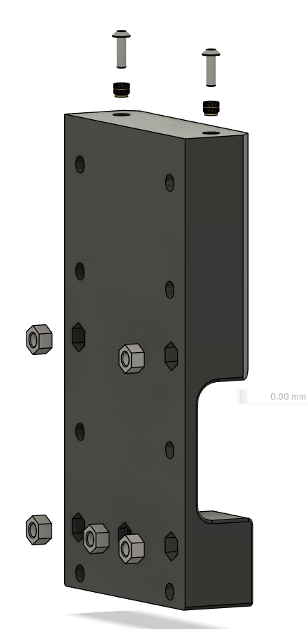
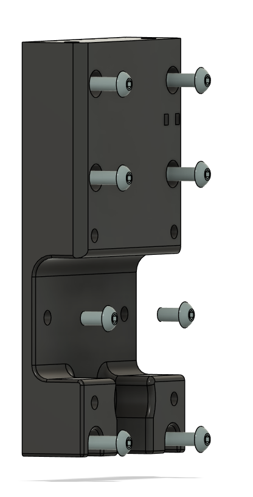
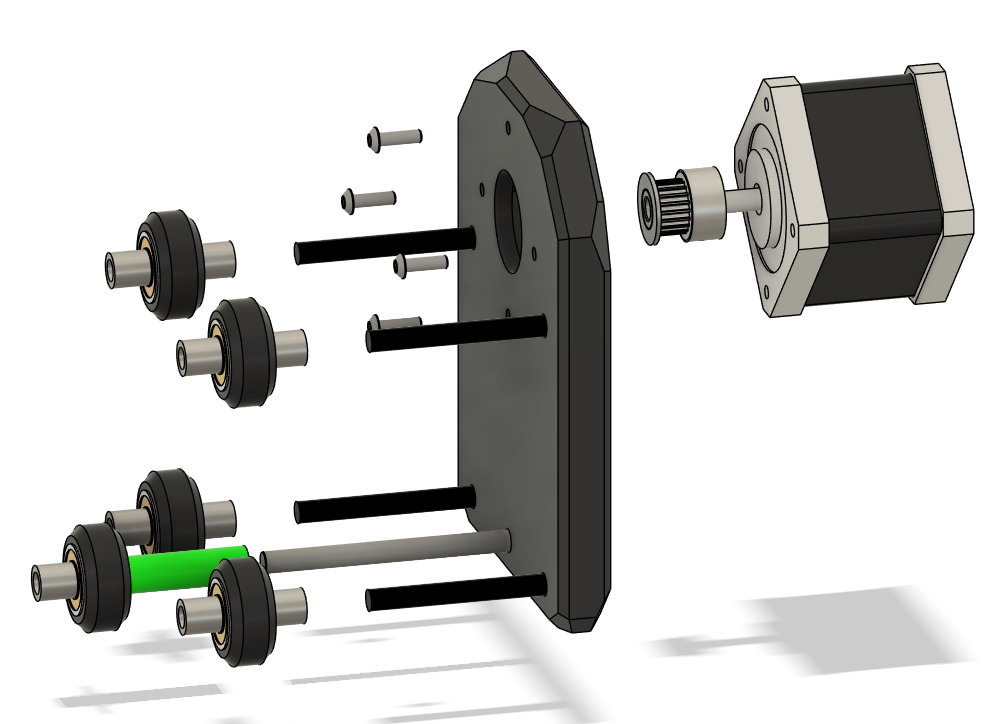
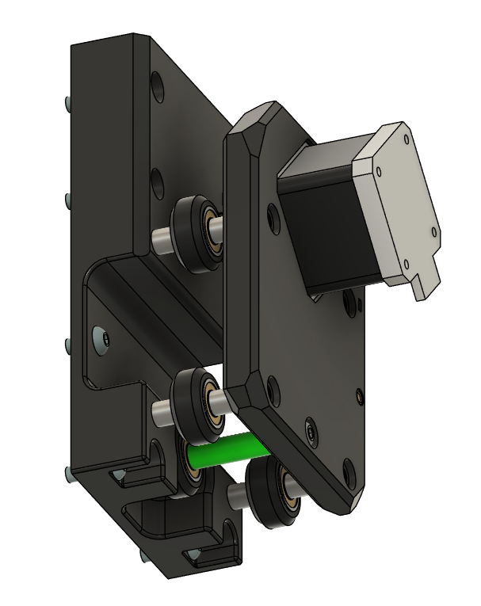
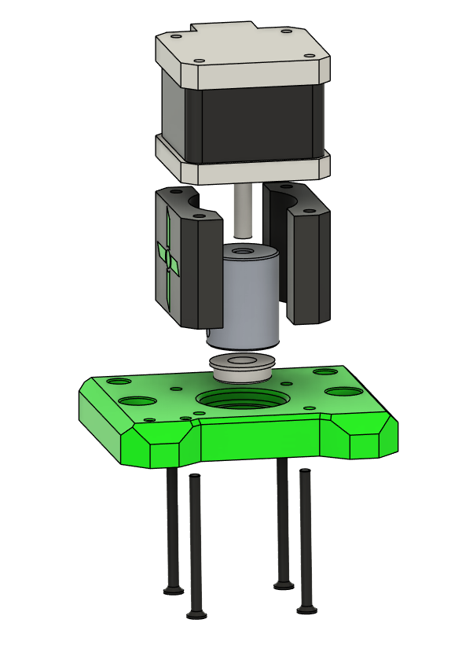
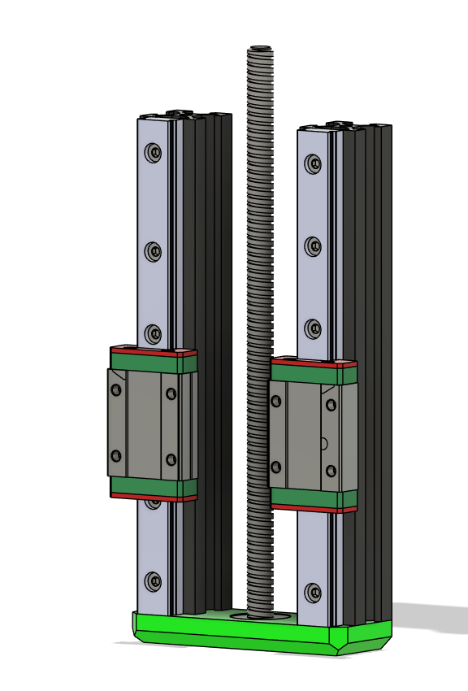
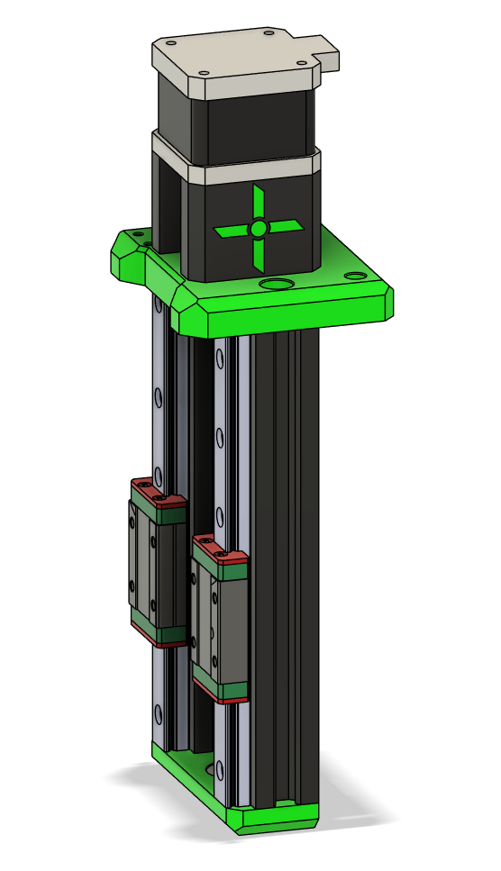

# Z Carriage Assembly

This chapter focuses on the Z-axis carriage, bearings, and coupler alignment.

---

## Assemble the X+Z Carriage

1. Cut Ender3 2020 extrusions to 150mm x2.  
2. Tap M5 threads in **both ends** of the 150mm extrusions.  
3. Press in bearings if not already done.  
4. Loosely attach:
   - Z motor coupler
   - X motor pulley (20T)
5. Attach both motors to their plates.  
6. Assemble the 2020 extrusions as square and parallel as possible.  
7. Mount the X motor carriage to the ZX carriage with wheels and spacers.  
8. Attach the Z bottom bearing plate and Z motor plate.  
9. Mount the MGN12 rails with carriages to the 2020 extrusions:
   - Use a printed **MGN12->2020 alignment tool** to ensure straight rails.  
   - Rails can slide into cutouts if slightly too long (max 4mm overhang).  
10. Attach Z leadscrew nut to Z carriage.  
11. Mount Z carriage to MGN12H carriages:
    - Slide up and down to check for binding. Adjust rails if necessary.  
12. Cut leadscrew to size (~180mm), double-check with your setup.  
13. Screw leadscrew from bottom bearing to Z motor coupler and secure.  
14. Slide the X+Z assembly on the previously cut X extrusion.

## Parts Required

| Qty | Item          | Source | Notes |
|-----|---------------|--------|-------|
| 1pc | Z Carriage Plate | Printed | Heatset inserts required |
| 2pc | M5 Locknuts      | Buy    | Press-fit into plate |
| 2pc | M5x16 BHSC       | Buy    | Z-axis carriage attachment |
| 1pc | Leadscrew Nut    | Buy    | M5 threaded for Z |
| 2pc | MGN12H Carriages | Buy    | For smooth linear motion |

## Bearing Choice

### If you dont have 608Z use the F688Z from the Ender 3 Pro X axis tensioner. 

---

## Backplate Assembly

1. Insert heatset inserts into Z carriage plate.  
2. Press-fit M5 locknuts into their designated holes.  

3. Attach M5 Locknuts and Bolts to Z carriage plate.
  

4. Assemble X gantry motor plate

5. Attach X gantry motor plate to xz gantry plate

---

## Frontplate 

1. Attach motor to top plate
2. Loosely attach coupler to Z motor shaft.  

1. Attach bottom plate to extrusion
2. Attach 2020 Extrusion to rails  
3. Attach MGN12H carriages to the 2020 extrusions if not already done.  
4. Slide Z carriage onto MGN12H carriages.  

5. Attach leadscrew nut to Z carriage.  
6. Attach z top to extrusion by inserting leadscrew from bottom bearing to coupler:
   - Ensure smooth rotation by hand.  
   - Adjust alignment if carriage binds on rails.

---

## Assembly

Attach Backplate to Extrusion and top screws

---

## Tips & Tricks

!!! tip
    Test the Z-axis movement **manually** before wiring the motors.  
    Smooth motion now saves time troubleshooting later.

!!! warning
    Avoid forcing the leadscrew; misalignment can strip threads in the coupler.

---

!!! tip
    Ender3 aluminum spacers are 8.35mm. If using 8mm spacers from another source, use the **printed lower middle spacer** to maintain alignment.

---
    
## Ready to Proceed?

After completing these steps, your ready for **Gantry Assembly**.

  <a href="/EnderCNC/gantry_ends" class="md-button md-button--primary">
    Continue to Gantry Assembly →
  </a>

