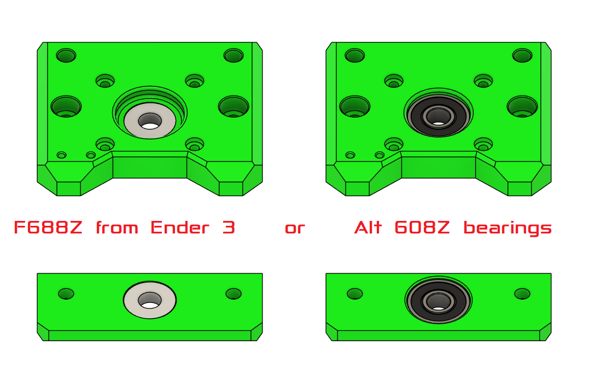

# Z Carriage Assembly

This chapter focuses on the Z-axis carriage, bearings, and coupler alignment.

---

## 1. Parts Required

| Qty | Item          | Source | Notes |
|-----|---------------|--------|-------|
| 1pc | Z Carriage Plate | Printed | Heatset inserts required |
| 2pc | M5 Locknuts      | Buy    | Press-fit into plate |
| 2pc | M5x16 BHSC       | Buy    | Z-axis carriage attachment |
| 1pc | Leadscrew Nut    | Buy    | M5 threaded for Z |
| 2pc | MGN12H Carriages | Buy    | For smooth linear motion |

## Bearing Choice

### If you dont have 608Z use the F688Z from the Ender 3 Pro X axis tensioner. 

---

## 2. Installation Steps

1. Insert heatset inserts into Z carriage plate.  
2. Press-fit M5 locknuts into their designated holes.  
3. Attach MGN12H carriages to the 2020 extrusions if not already done.  
4. Slide Z carriage onto MGN12H carriages.  
5. Attach leadscrew nut to Z carriage.  
6. Loosely attach coupler to Z motor shaft.  
7. Insert leadscrew from bottom bearing to coupler:
   - Ensure smooth rotation by hand.  
   - Adjust alignment if carriage binds on rails.

---

## 3. Tips & Tricks

!!! tip
    Test the Z-axis movement **manually** before wiring the motors.  
    Smooth motion now saves time troubleshooting later.

!!! warning
    Avoid forcing the leadscrew; misalignment can strip threads in the coupler.
