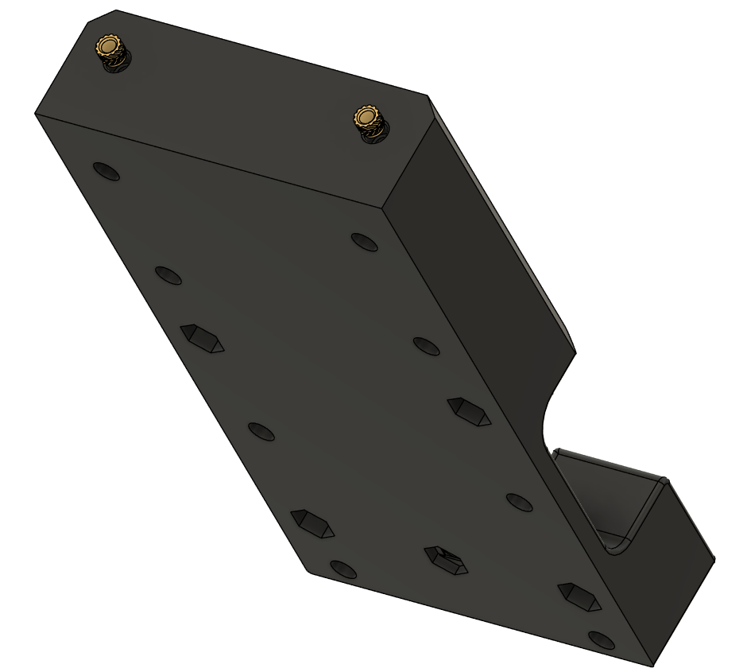
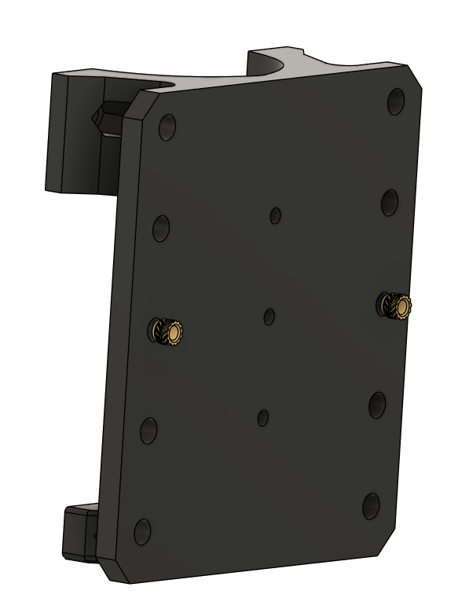
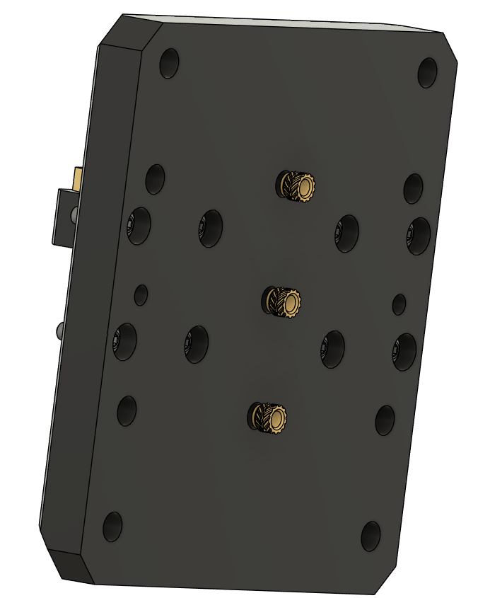
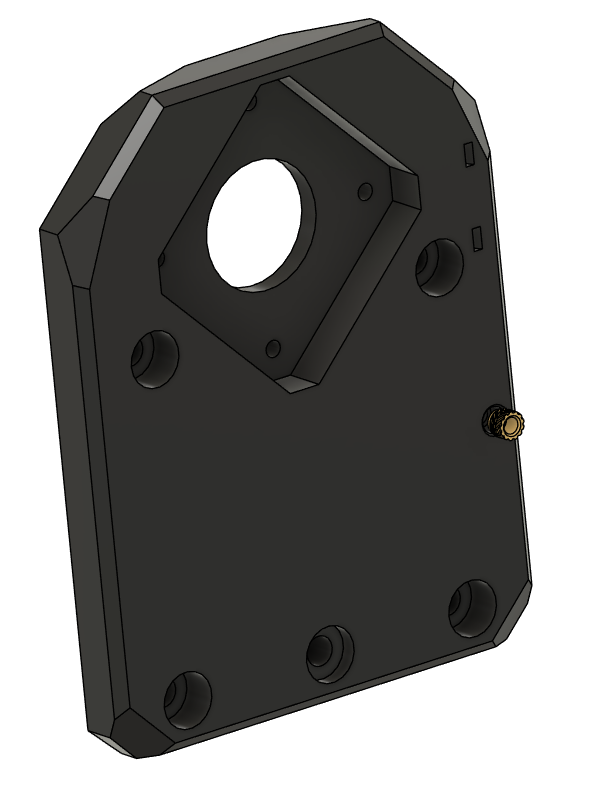
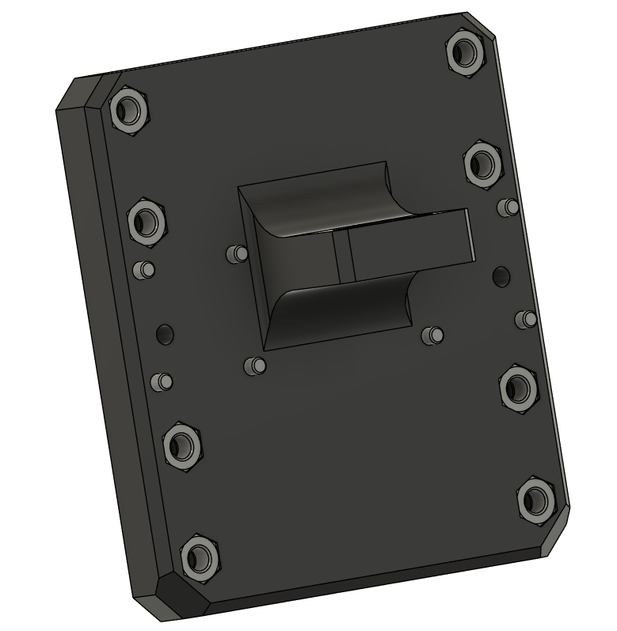

# Carriage Heatsets

This chapter covers the heatsets and pressfits for the carriage.

---

## 1. Parts Required

| Qty   | Item                    | Source   | Notes                        |
|-------|-------------------------|----------|------------------------------|
| 7pc   | M3 Heatsets             | Buy      |  M3x5x4 "Voron spec"         |
| 12pc  | Lock Nuts               | Buy      |                              |

### Heatsets

#### XZ Carriage Plate

#### Dremel Plate

#### Z Carriage

#### X-Motor plate

---

### Pressfit Locknuts

### Z Carriage

#### XZ Carriage Plate

---

## 2. Notes

!!! warning
    Make sure heatsets are flush and perpendicular.

!!! tip
    You may want to add a dab of superglue to the lock nuts to keep them in place.

---

## Ready to Proceed?

After completing these steps, your Tool head carriage assmbly is ready for **Bearings**.

  <a href="/EnderCNC/carriage_bearings" class="md-button md-button--primary">
    Continue to Carriage Bearings Assembly →
  </a>

