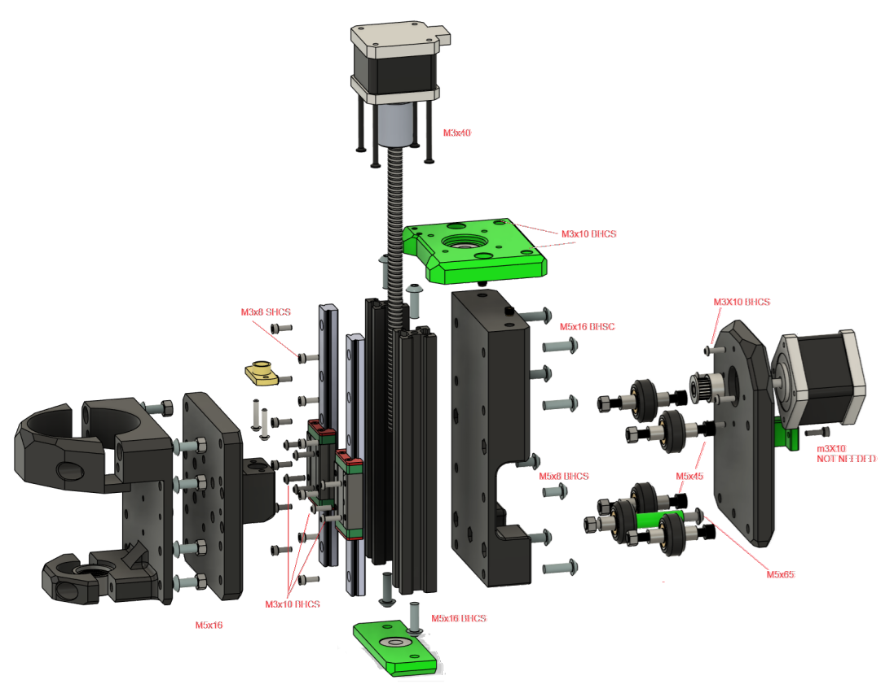
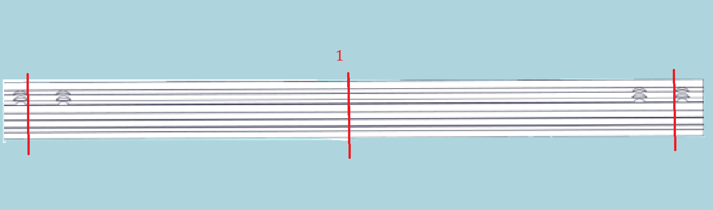
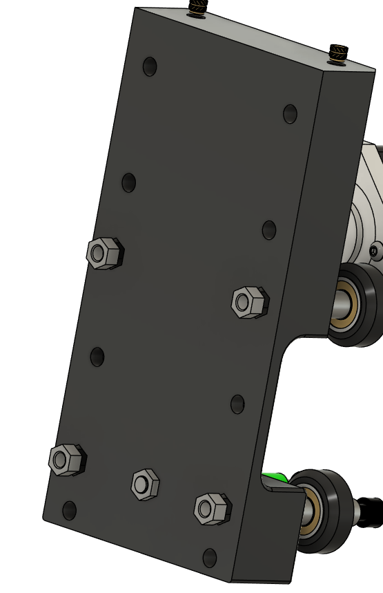

# Carriage Assembly

This chapter covers assembling the carriage, mounting motors, bearings, and spacers.

---

## Parts Required

| Qty   | Item                    | Source   | Notes                        |
|-------|-------------------------|----------|------------------------------|
| 4pc   | M3x8 BHSC               | Ender3   |                              |
| 2pc   | M3x10                   | Buy      |                              |
| 10pc  | M5x16 BHSC              | Buy      |                              |
| 2pc   | M5x8 BHSC               | Ender3   |                              |
| 4pc   | M3x40                   | Ender3   |                              |
| 4pc   | M5x45 SHSC              | Ender3   | Remove shims                 |
| 1pc   | M5x65 BHSC              | Buy      |                              |
| 12pc  | M3x8 SHSC               | Buy      |                              |
| 2pc   | M3x16 BHSC              | Ender3   |                              |
| 9pc   | Aluminum Spacers        | Ender3   |                              |
| 1pc   | 28.35mm Printed Spacer  | Printed  |                              |
| 5pc   | V-Wheels                | Ender3   |                              |
| 4pc   | 32.60mm Printed Spacer  | Printed  |                              |
| 8pc   | M3x10 BHSC              | Ender3   |                              |

---

## Assembly Exploded

For reference only, this will be explained step by step.

---

## Cut the Top rail into 2 150mm pieces for Z axis

!!! Tip
    When cutting the z rail start with the center cut `1` and then cut the outside through holes off so there is more extrusion to thread on to and it is easier to make sure they are the same length.
    

---

## Install heatsets and pressfits for the carriage.

### Parts Required

| Qty   | Item                    | Source   | Notes                        |
|-------|-------------------------|----------|------------------------------|
| 7pc   | M3 Heatsets             | Buy      |  M3x5x4 "Voron spec"         |
| 12pc  | Lock Nuts               | Buy      |                              |

### Heatsets

!!! warning
    Make sure heatsets are flush and perpendicular.
    
**XZ Carriage Plate**

**Dremel Plate**

**Z Carriage**

**X-Motor plate**

    
---

### Pressfit Locknuts

!!! tip
    You may want to add a dab of superglue to the lock nuts to keep them in place.

**Z Carriage**

**XZ Carriage Plate**

---

## Ready to Proceed?

After completing these steps, your start assembling the **Carriage Assembly**.

  <a href="/EnderCNC/carriage_assembly" class="md-button md-button--primary">
    Continue to Carriage Assembly →
  </a>

