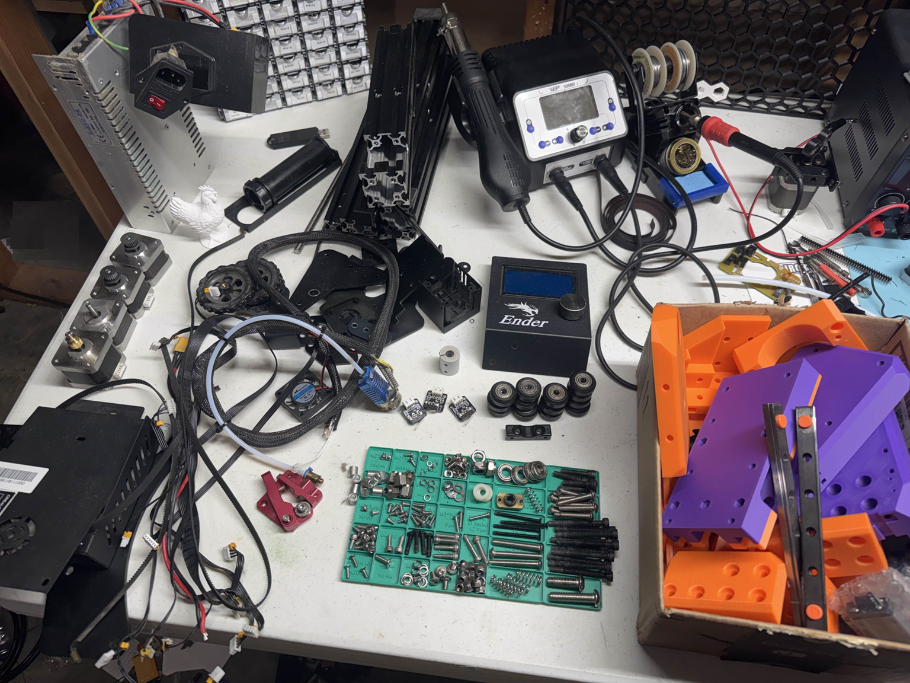

#  Disassemble your old Ender 3

It may seem obvious but in order to build the frame the old Ender must be disassembled.

The parts tray organizer is usefull for keeping all the parts from running away while you are working on the build.

You will thank yourself later for having a clean and organized work area (I wish I could live up to this!)

---

## Ready to Proceed?

After completing these steps, you are ready to start on the **Carriage Assembly**.

  <a href="/EnderCNC/carriage_prep" class="md-button md-button--primary">
    Continue to Carriage Assembly →
  </a>

