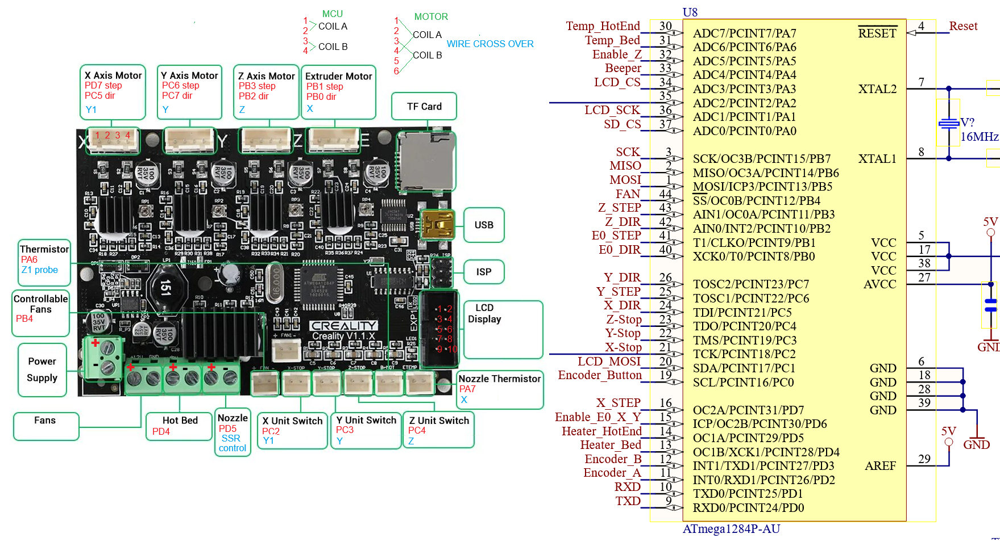
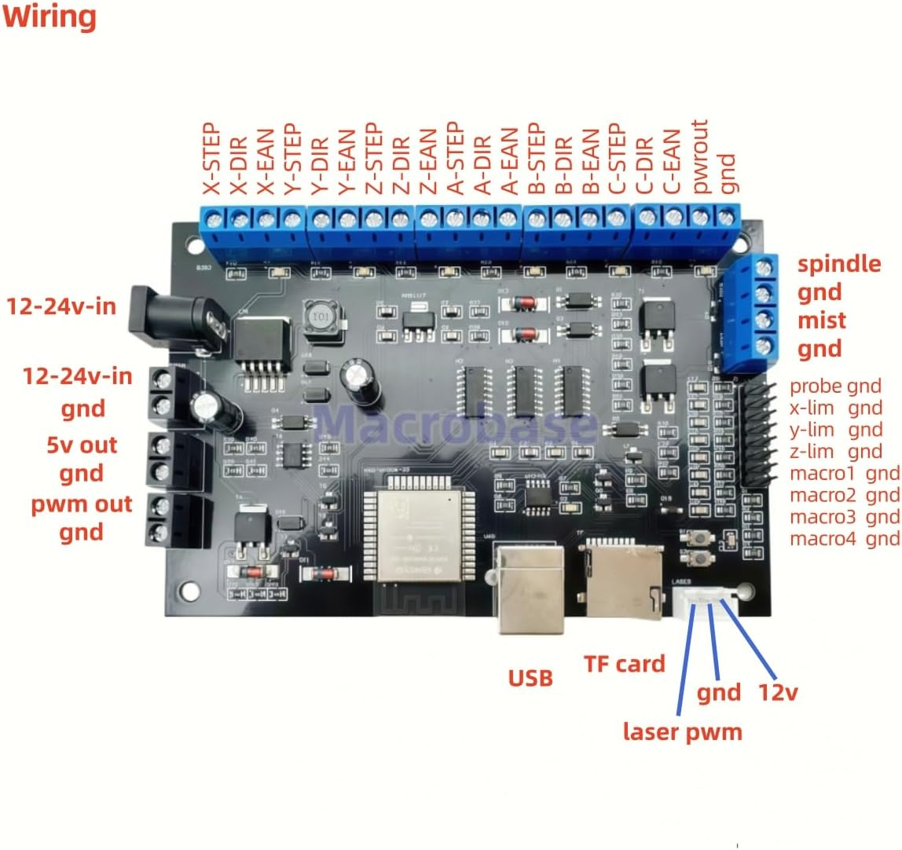

# Firmware Setup

This chapter explains firmware options for your Ender 3 CNC conversion.

---

## Supported Options

| Firmware | Notes |
|----------|-------|
| Klipper  | Recommended if a Raspberry Pi or old laptop is available |
| GRBL     | Standard CNC option, must purchase an ESP32/32-bit board |

---

## Klipper Setup

1. Follow standard Klipper installation on your Raspberry Pi or Linux laptop. We recommend [dw-0/kiauh](https://github.com/dw-0/kiauh) to get started.

2. Copy a reference `printer.cfg` for the Ender CNC:
   * Make sure the stepper, endstop, spindle, and belt parameters are correct for your MCU
   * Make sure all motors are spinning correctly and settings are correct for your MCU
  
3. Test all axes manually before enabling motor power.

4. Configure homing and probe offsets for your spindle.

### Example configs

* [Version 1.1.x Ender MCU printer.cfg](/klipper/v1.1.x_printer.cfg) Original Ender 3
* [Version 4.2.2 Ender MCU printer.cfg](/klipper/v4.2.2_printer.cfg) Ender 3 Pro
* [Version 4.2.7 Ender MCU printer.cfg](/klipper/v4.2.7_printer.cfg) Latest Ender 3 pro

### How to document your mainboard

Notice in the picture that the processor and motor has documented pins.

---

## GRBL Setup / FluidNC

1. Flash your GRBL-compatible board according to manufacturer instructions.  
2. Use the reference configuration for stepper settings, endstops, and spindle control.  
3. Test movement manually before running any G-Code.

**[FluidNC](https://eghasemy.github.io/FluidNC_GUI/docs/getting-started/understanding-fluidnc/) Setup**

**Typical GRBL CAM software**

* [Candle](https://github.com/Denvi/Candle)
* [OpenBuilds](https://software.openbuilds.com/)
* [PlanetCNC](https://planet-cnc.com/download.html)

---

### IMPORTANT NOTES

>Don't let the magic smoke out!

!!! tip
    Keep a backup of working firmware configuration before making major changes.

!!! warning
    Never run motors at full speed during first test

!!! warning
    Verify wiring because Creality motors have crossover wires.

!!! warning
    Y axis has one motor inverted. Test Y motor without belts first.
