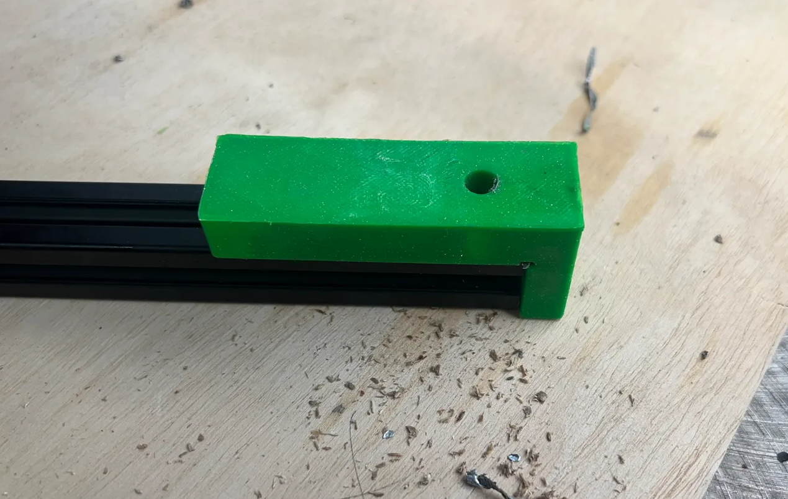
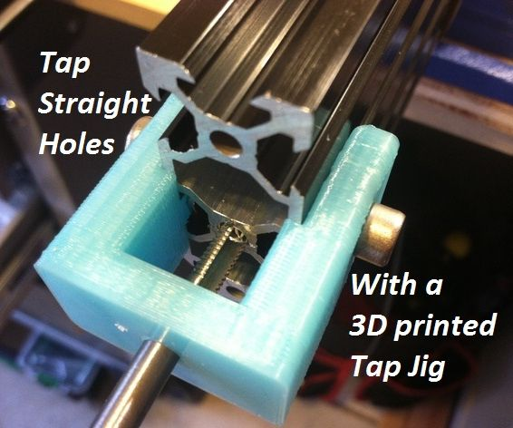
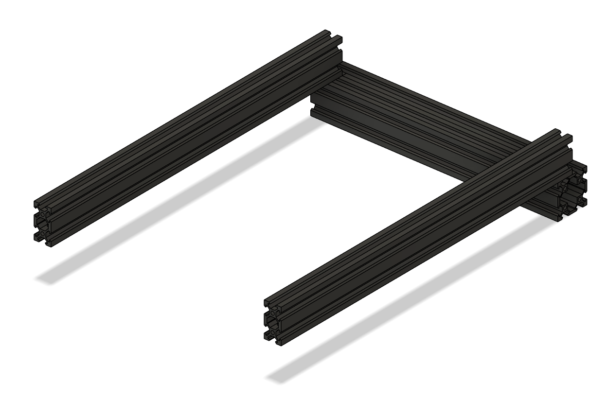
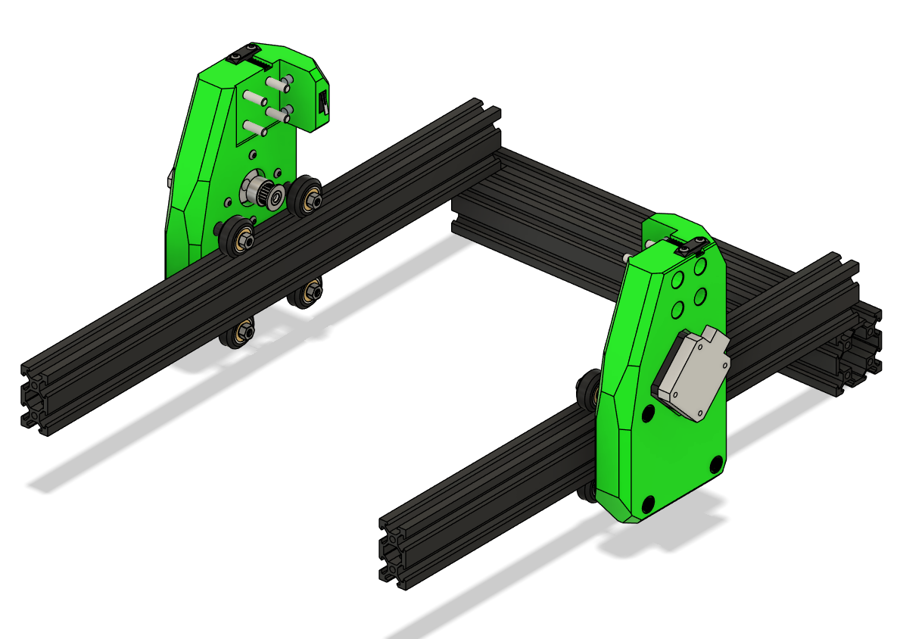
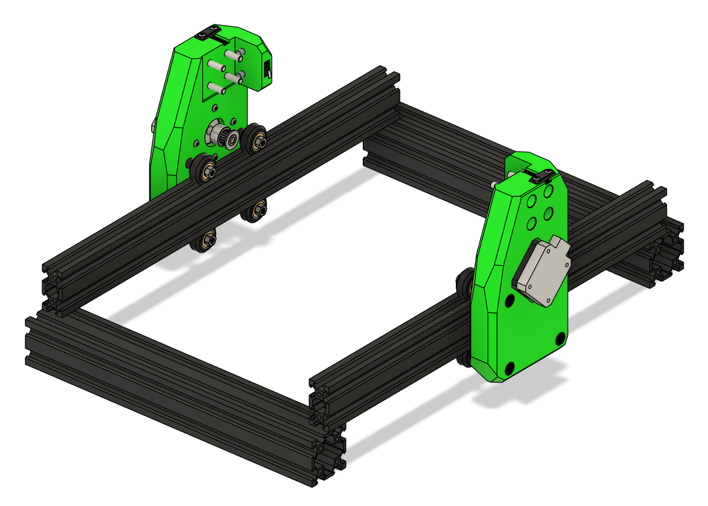
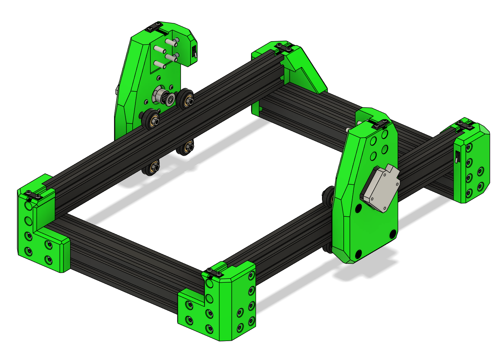

# Frame Assembly

This chapter walks through building the Ender 3 CNC frame.

---

## Parts Required

| Qty  | Item           | Source  | Notes |
|------|----------------|---------|-------|
| 48pc | M5x16 BHSC     | Buy     | Frame bolts |
| 4pc  | M5x40          | Ender3  | Z-axis attachment |
| 4pc  | M5x8           | Ender3  | Extra spacers |
| 4pc  | M5 1mm Shims   | Buy     | For precise leveling |
| 52pc | M5 T-nuts      | Buy     | Frame assembly |
| 2pc  | 4020x400mm     | Ender3  | Extrusion |
| 2pc  | 4040x290mm     | Ender3  | Extrusion |

---

## Ready Extrusion

### Cut Extrusion (if needed)

1. Measure your frame; Ender 3 frames may vary ± a few mm.  
2. Cut extrusion to size (use a machinest square to make sure they are square.)
4. Tap **4 new M5 threads** on the cut side.  

!!! tip
    If you are unsure, measure six times before cutting. Once cut, you cannot undo it.

---

### Drill Through holes for Blind joints

These allow you to put a hex key through the hole to tighten the bolt below.

### should be 20mm on center offset both front and back. 
  

---

#### Tap Ends 

of all the Extrusions

---

## Add Heat Inserts

---

## XY Joints

1. Lay out the aluminum extrusions with 4040s on the ends and 4020s perpendicular.  
2. Take note of **blind joints** and the **20mm offset** on the extrusion.  
3. Loosely attach M5 bolts and T-nuts to hold the frame together on one side.  

!!! tip
    Leave loose until all corners are in place.

4. Mount XY Joints to Frame¶

    * Slide the XY joints onto the 2020 frame extrusions
    * Place the bottom V-wheels into the V-slot.
    * Loosely add M5 locknuts to the bottom wheels.
    * Tilt the XY joint slightly to insert the top wheels into the V-slot.
    * Wiggle the assembly so the top screws pop into place.

    !!! Warning
        The XY joints are pressfit in some positions; force gently and double-check alignment.

5. Add the front 4040 and loosely attach M5 bolts and T-nuts.

6. Attach corners

7. Check that the frame is **square**:
   - Measure diagonals; they should be equal.  
   - Adjust joints as necessary.
   - **Fully tighten all the bolts**

!!! tip
    Use a **flat surface** when squaring the frame for best results.

---

### Check Alignment
* Measure the distance between the X extrusion mounting points — Ender 3 frames may vary by ± a few millimeters.  
* Adjust the XY joints as necessary to ensure smooth motion.  
* After positioning correctly, tighten all screws carefully.  

---

### Verify Motion
* Slide the XY gantry along the X and Y axes by hand.  
* Ensure wheels roll smoothly without binding.  
* Check pulley alignment with belts — adjust if necessary before attaching the endstop.  

---

### Troubleshooting
* **Wheels bind or grind:** Check spacers, alignment, and V-slot cleanliness.  
* **XY gantry wobbles:** Ensure M5 locknuts are tight and spacers are correct length.  
* **Pulleys misaligned:** Re-position 20T pulleys before tensioning belts.  

---

### Measure and Cut the Gantry if Needed

1. Cut the X-axis extrusion to length (check your frame’s actual measurement).  
2. Tap new M5 threads on the cut ends.  
3. Proceed with **X+Z carriage assembly** as described in the next section of the manual.

!!! warning
    **DO NOT ATTACH THE GANTRY YET.** 
    It is done AFTER the carriage is attached.

---

## Final Checks

- Ensure frame is **square and rigid**.  
- Tighten bolts in blind joints. 

!!! warning
    Do **not press in the endstops** until wiring is complete. They are press-fit and may be difficult to remove afterward.

---

## Ready to Proceed?

Once you have completed the frame assembly, you are ready to finish the **Gantry Assembly**.

  <a href="/EnderCNC/gantry" class="md-button md-button--primary">
    Continue to Final Gantry Assembly →
  </a>

