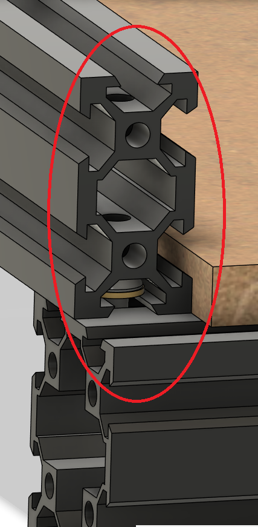
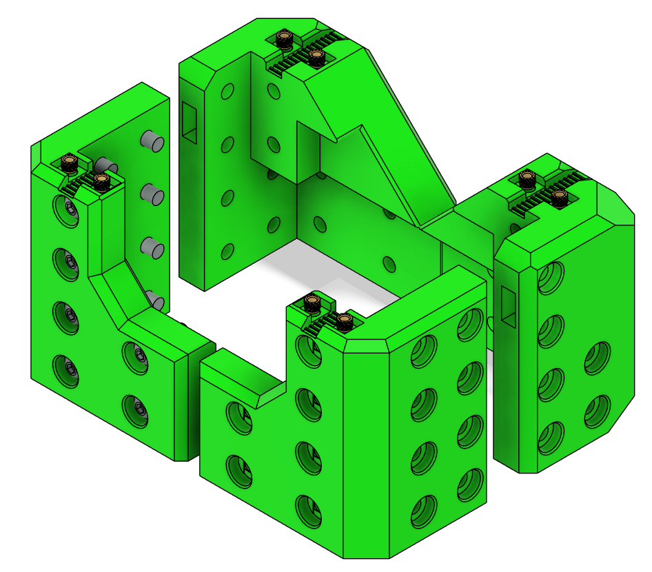
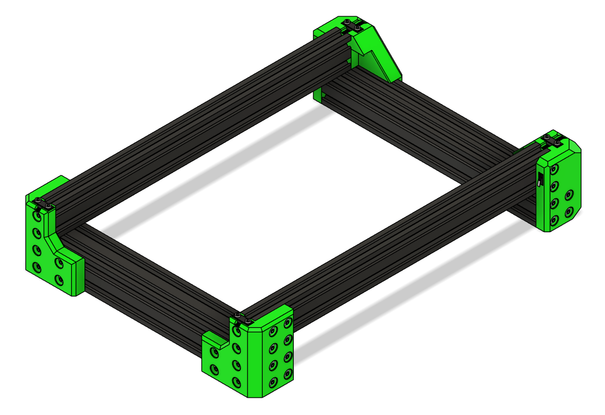

# Frame Assembly

This chapter walks through building the Ender 3 CNC frame.

---

## Parts Required

| Qty  | Item           | Source  | Notes |
|------|----------------|---------|-------|
| 48pc | M5x16 BHSC     | Buy     | Frame bolts |
| 4pc  | M5x40          | Ender3  | Z-axis attachment |
| 4pc  | M5x8           | Ender3  | Extra spacers |
| 4pc  | M5 1mm Shims   | Buy     | For precise leveling |
| 52pc | M5 T-nuts      | Buy     | Frame assembly |

---

## Safety Notes

!!! warning
    Do **not press in the endstops** until wiring is complete. They are press-fit and may be difficult to remove afterward.

---

## 1. Cut X Extrusion

1. Measure your frame; Ender 3 frames may vary ± a few mm.  
2. Cut X extrusion to size.  
3. Tap **4 new M5 threads** on the cut side.  

!!! tip
    If you are unsure, measure twice before cutting. Once cut, you cannot undo it.

---

## 2. Assemble the Frame

### Blind Joints

#### should be 20mm offset both front and back. 
  

!!! tip
    Leave loose until corners are in place.

---

## 3. Heat Inserts

---

## 4. XY Joints

1. Lay out the aluminum extrusions according to the frame diagram.  
2. Take note of **blind joints** and the **20mm offset** on the back extrusion.  
3. Loosely attach M5 bolts and T-nuts to hold the frame together.  
4. Check that the frame is **square**:
   - Measure diagonals; they should be equal.  
   - Adjust joints as necessary.

!!! tip
    Use a **flat surface** when squaring the frame for best results.

---

## 6. Final Checks

- Ensure frame is **square and rigid**.  
- Endstops are still **unpressed** for now.
- Tighten bolts in blind joints. 

---

## Ready to Proceed?

After completing these steps, you are ready to start on the **Carriage Assembly**.

  <a href="/EnderCNC/carriage_heatsets" class="md-button md-button--primary">
    Continue to Carriage Assembly →
  </a>

