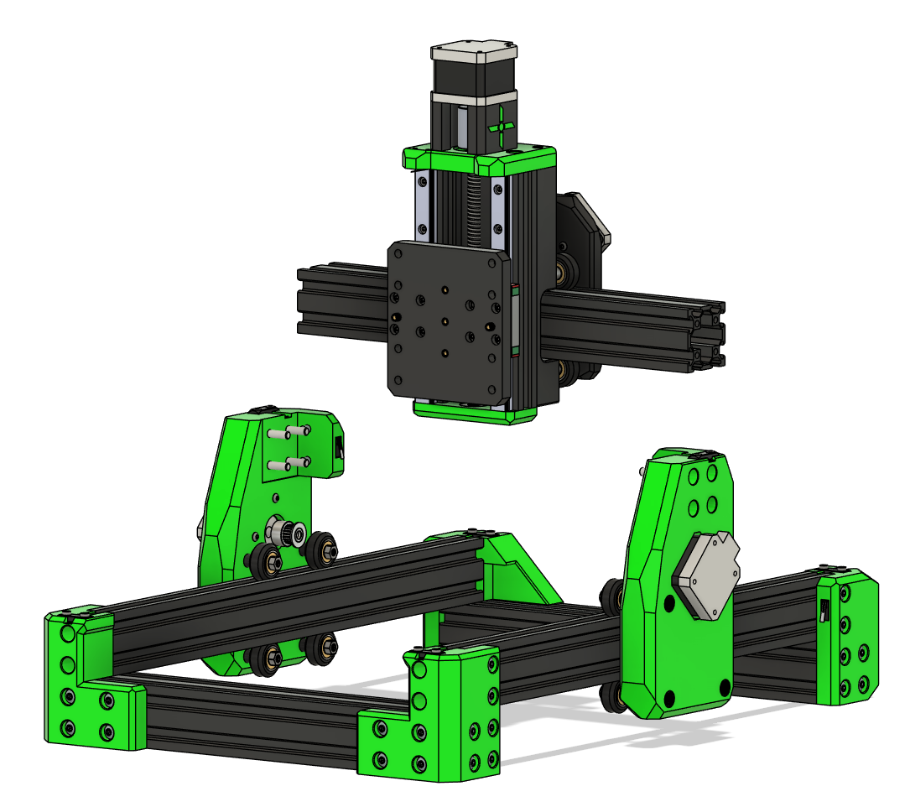

# Final Gantry Assembly

## Mount Carriage to Gantry¶

  * Slide the carriage onto the 4040 frame extrusions by place the V-wheels into the V-slots.

!!! Warning
    Use gentle force and double-check alignment.

---

## Mount Assembly to Frame

### Parts Needed

| Qty  | Item           | Source  | Notes |
|------|----------------|---------|-------|
| 8pc  | M5x30 BHSC     | Buy     | Frame bolts |

Attach bolts and the frame is complete

---

## Ready to Proceed?

You have now completed the frame assembly and ready to move on to the **Belts and Endstops**.

  <a href="/EnderCNC/belts" class="md-button md-button--primary">
    Continue to Belts →
  </a>

