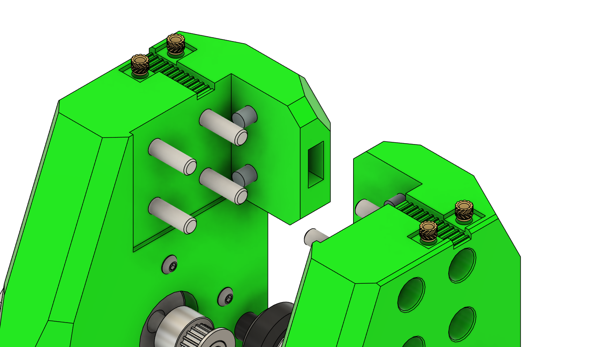
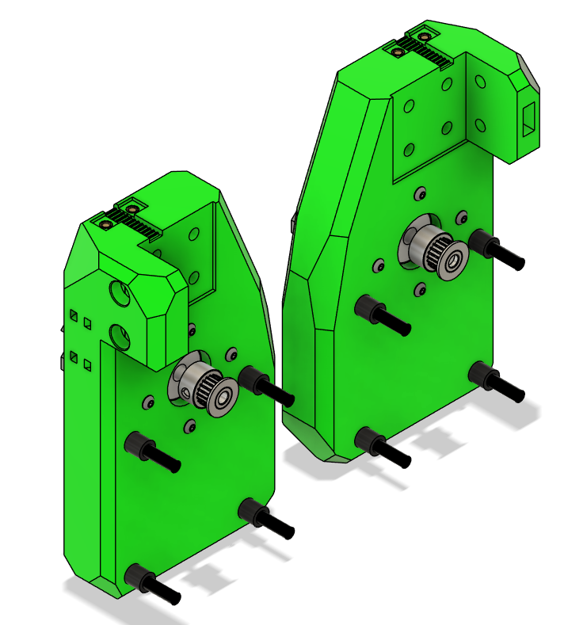
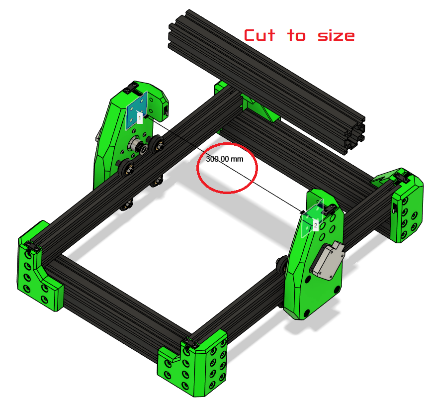

# Gantry

!!! Note:
    Press fits and tolerances may vary slightly between frames.

## Parts Required

| Qty | Part                                    | Source | Notes |
|-----|-----------------------------------------|--------|-------|
| 4pc | Heatset                                 | Buy    | Voron Spec |
| 8pc | M5x45 SHSC                               | Ender3 | Remove shims from these |
| 8pc | M3x10                                    | BUY    |       |
| 8pc | 8mm Spacer (Printed or 5mm bore Alu)    | BUY    | |
| 8pc | V-Wheels                                 | Ender3 |       |
| 8pc | M5 Locknuts                              | Ender3 or BUY |       |

---

## Assembly Steps

### Pre-assemble XY Joints
* Remove stock pulley from motor with puller if not done already.
* Loosely attach the 20T pulleys to the X-motor if not done already.
* Insert heatsets
* Slide the M5x45 screws through the XY joint mounting holes.  
* Place the 8mm spacers between the XY joint and the wheel mounts.  
* Add the M3x10 screws for securing the top/bottom brackets.  

> **Tip:** Do not tighten fully yet — we will adjust alignment on the frame.

### Mount XY Joints to Frame
* Slide the XY joints onto the 2020 frame extrusions
* Place the bottom V-wheels into the V-slot.  
* Loosely add M5 locknuts to the bottom wheels.  
* Tilt the XY joint slightly to insert the top wheels into the V-slot.  
* Wiggle the assembly so the top screws pop into place.

!!! Tip
    It may be easier to fully assemble the xy joints and then take the front corners off the frame to get the xy joints on.

!!! Warning
    The XY joints are pressfit in some positions; force gently and double-check alignment.

### Mount Carriage Assmbly to Gantry

****

### Mount the Gantry to the XY Joints

---

### Check Alignment
* Measure the distance between the X extrusion mounting points — Ender 3 frames may vary by ± a few millimeters.  
* Adjust the XY joints as necessary to ensure smooth motion.  
* After positioning correctly, tighten all screws carefully.  

!!! Tip
    You can temporarily remove the 2040 extrusions from the frame to slide XY joints on if needed. You may need to re-square the frame afterward.

---

### Verify Motion
* Slide the XY gantry along the X and Y axes by hand.  
* Ensure wheels roll smoothly without binding.  
* Check pulley alignment with belts — adjust if necessary before attaching the endstop.  

---

### Troubleshooting
* **Wheels bind or grind:** Check spacers, alignment, and V-slot cleanliness.  
* **XY gantry wobbles:** Ensure M5 locknuts are tight and spacers are correct length.  
* **Pulleys misaligned:** Re-position 20T pulleys before tensioning belts.  

---

### Next Steps
Once XY joints are installed and verified:

1. Cut the X-axis extrusion to length (check your frame’s actual measurement).  
2. Tap new M5 threads on the cut ends.  
3. Proceed with **X+Z carriage assembly** as described in the next section of the manual.
