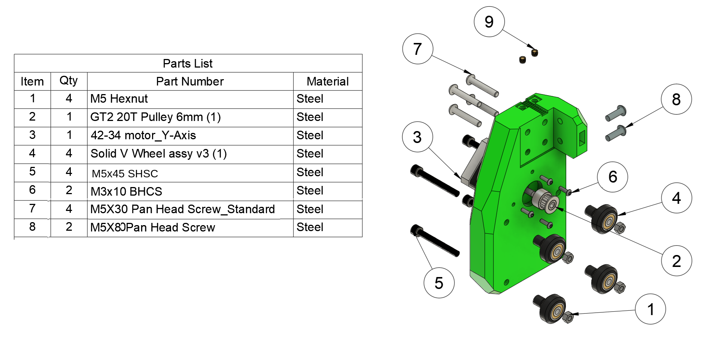
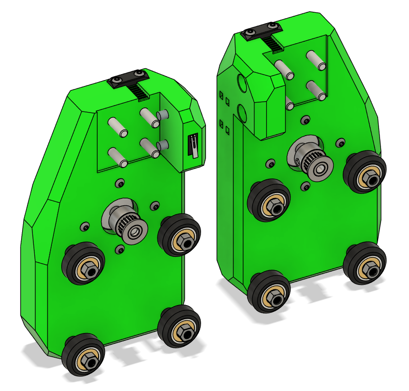

# Gantry

## Assemble the Gantry Brackets

!!! Note:
    Press fits and tolerances may vary slightly between frames.

## Parts Required

| Qty | Part                                    | Source | Notes |
|-----|-----------------------------------------|--------|-------|
| 4pc | Heatset                                 | Buy    | Voron Spec |
| 8pc | M5x45 SHSC                               | Ender3 | Remove shims from these |
| 8pc | M3x10                                    | BUY    |       |
| 8pc | 8mm Spacer (Printed or 5mm bore Alu)    | Ender3    | |
| 8pc | V-Wheels                                 | Ender3 |       |
| 8pc | M5 Locknuts                              | Ender3 or BUY |       |

#### Exploded View

---

## Assembly Steps

### Add Heatsets to XY Joints

* Insert heatsets

### Attach Nema17 Motors

* Remove stock pulley from motor with puller if not done already.
* Loosely attach the 20T pulleys to the X-motor if not done already.
* Add the M3x10 screws for securing the motor.

> **Tip:** Do not tighten fully yet — we will adjust alignment on the frame.

### Mount V-Wheels

* Slide the M5x45 screws through the XY joint mounting holes.  
* Place the 8mm spacers between the XY joint and the wheel mounts.  

### Add V-Wheels and Lock Nuts

---

## Ready to Proceed?

Once you have the gantry brackets assembled, continue to the next section to and begin the frame assembly.

  <a href="/EnderCNC/frame" class="md-button md-button--primary">
    Continue to Frame Assembly →
  </a>

