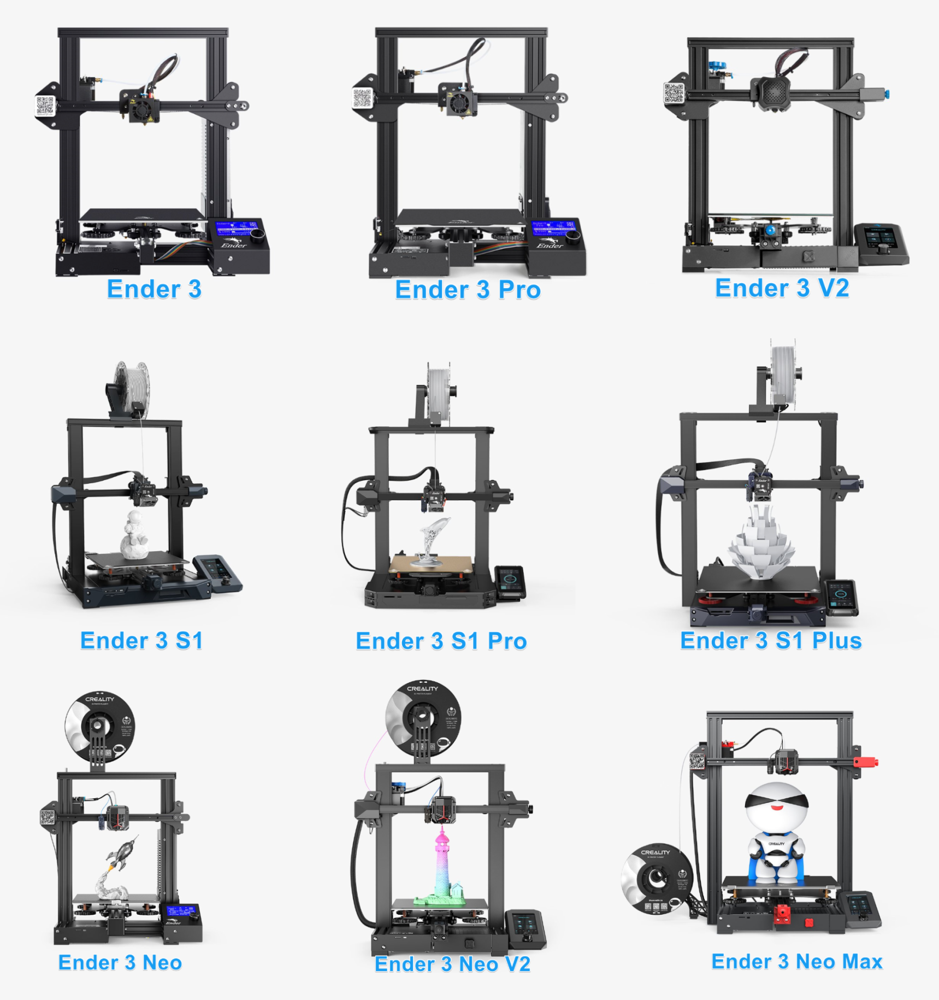

# Hardware Overview

This guide covers the core hardware needed to convert your Ender 3 (or Ender 3 Pro) into a desktop CNC machine. Parts are broken into reused components, items to purchase, and optional upgrades. Wherever possible, the BOM is aligned with common Voron 3D printer parts to make sourcing easier for hobbyists.

## Reused Ender 3 Parts

* **Frame & Structural Components** – keep most of the original aluminum extrusions and screws.
* **Electronics** - Original V1 and V4 MCU's have been tested.
* **Motors & Wiring** – stepper motors, wiring harnesses, and couplers.
* **Limit switches** – reuse up to 3, but you’ll need at least 1 additional switch.
* **Belts & Bearings** – 2 belts can be reused; plan to buy extra. Use existing bearings.
* **Fasteners** – most M3, M4, and M5 nuts and bolts can be salvaged.

!!! Note
    Modifications such as cutting the top 2020 extrusion for the z-axis require careful measurement.

## Differences betwen Ender 3 printers

There a few key differences between versions of Ender 3D Printers.

* Ender 3 and Ender 3 pro are essentially the same; for CNC conversion, the most significant difference is the extrusion used for the gantry.
* Other Ender 3 models are not covered here as they have not been tested.

### Part Differences

| Part                     | Ender 3  | Ender 3 Pro             | CNC Implication                                                 |
| ------------------------ | -------- | ----------------------- | --------------------------------------------------------------- |
| Y-axis plate Extrusion   | 2040     | 4040                    | Gantry needs 2 300mm extrusions purchased if original Ender 3   |
| V-wheels / rollers       | Plastic  | Slightly higher quality | CNC conversion uses same wheels but alignment becomes critical. |
| Screws & T-nuts          | Standard | Some upgraded           | Reuse as much as possible; minor differences.                   |
| Electronics              | V1.1.x   | V4.2.x                  | The Pro version is a better MCU                                 |

## Parts from Ender 3 

| Quantity | Part Description | Notes |
|----------|------------------|-------|
| **M5 Screws** |
| 10x | M5x30 button head | |
| 16x | M5x45 bolts | From E3P frame (remove shims if possible) |
| 4x | M5x8 | |
| 1x | M5x65 | Middle lower X axis wheel (optional) |
| All | M5 nuts | From your Ender 3 |
| **M4 Screws** |
| 2x | M4x20 | |
| 2x | M4x16 | |
| 2x | M4x10 | Includes 2x M4 t-nuts |
| **M3 Screws** |
| 6x | M3x10 | |
| 11x | M3x10 | Additional |
| 4x | M3x40 | |
| 12x | M3x6 | |
| **Bearings** |
| 2x | 688 bearings | If your E3P has these; otherwise buy 608ZZ |

!!! Note
    You can re-use 2 belt lengths from the Ender 3, but you still need one more ~350mm length. 

!!! Tip
    You can re-use 3 limit switches from the Ender 3, if you want to cut them off the PCB's but you'll still be missing 1, so you need to order AT LEAST 1 more, it is probably easier just to buy a new set if you go with this option. The recommendation is to go with the endstop mod.

---

## Parts to Purchase

| Quantity | Part Description | Specifications | Notes |
|----------|------------------|----------------|-------|
| **Extrusion** |
| 2x | 2040 v-slot or 4040 v-slot | 300mm | Only for Original Ender |
| **Motion Components** |
| 3x | GT2 belts | ~500mm length each, 6mm width | Buy 3-5 meter roll |
| 3x | GT2 pulleys | 20T, 6mm width, 5mm bore | |
| 2x | MGN12H linear rails | 150mm length | 1 carriage per rail |
| 2x | 608ZZ bearings | 8x22x7mm | Or use 688 from Ender 3 |
| **Electronics** |
| 4x | D2F-L Microswitch | Limit switch | Get 10 pack |
| **Fasteners** |
| ~20x | M3 T-nuts | For 2020 extrusion | Sliding or standard t-nuts |
| ~40x | M5 T-nuts | For 2020 extrusion | Sliding or standard t-nuts |
| 10x | M5 locknuts | Hex nuts | |
| ~70x | M5x16 button head screws | | |
| 22x | M3x10 screws | Not countersunk | |
| 12x | M3x8 SHCS | Socket head cap screws | |
| **Hardware** |
| 30x | Heat set inserts | M3x4x5mm | Voron spec |
| 4x | M5 shims | OD 10mm, ID 5mm, 1mm thick | |

---

## Optional Upgrades

| Quantity | Part Description | Specifications | Purpose |
|----------|------------------|----------------|---------|
| 8x | Aluminum spacers | 5mm ID x 8mm OD x 8mm length | Replaces printed Y axis wheel spacers |
