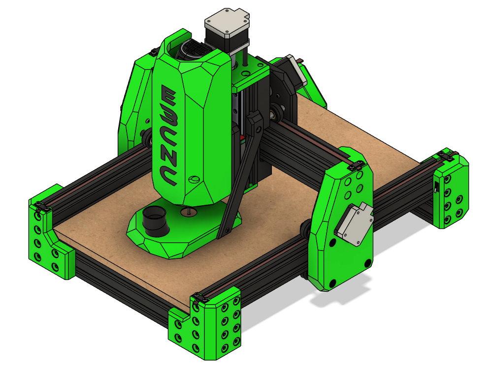
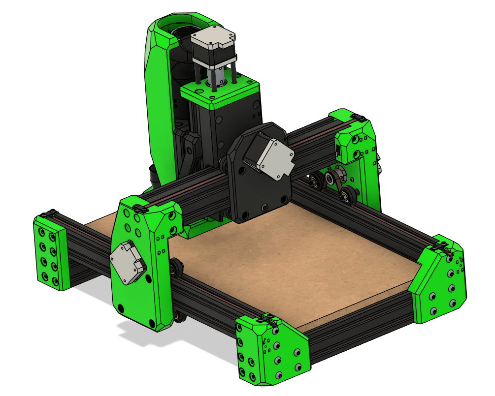

# Ender 3 CNC Build Manual

## Converting a Proven Motion Platform into a Precision CNC System

The Ender 3 is a well-understood, mechanically consistent motion platform.
Ender3CNC transforms it into a capable desktop CNC machine — not as a novelty conversion, but as a deliberate, mechanically considered upgrade.

This manual provides a structured, engineering-focused pathway to convert a standard Ender 3 (or Ender 3 Pro) into a rigid, repeatable CNC platform using:

* Maximum hardware reuse
* Minimal additional cost
* Documented design decisions
* Tested configurations

The result is a machine capable of cutting hardwood, plastics, and aluminum while maintaining affordability and accessibility.

---

!!! note "Work in Progress"
  This documentation is under active development.
  Revisions, refinements, and corrections are ongoing.
  If you encounter an issue or want to contribute feedback:
  [https://github.com/john-clark/EnderCNC/issues](https://github.com/john-clark/EnderCNC/issues)

!!! warning "Early Release"
  This is Version 1 of the manual. Expect frequent iterative improvements.

!!! tip "Recommended Approach"
  Follow the chapters sequentially. Mechanical alignment, structural rigidity, and configuration steps build on one another.

---

## Design Philosophy

This project is not about bolting a spindle onto a printer.

It is built around three engineering priorities:

### 1. Structural Efficiency

Reinforce where loads increase. Preserve geometry where it is already sufficient.

### 2. Maximum Reuse

Retain as much of the original machine as possible — frame, motion components, electronics — to reduce cost and complexity.

### 3. Controlled Scalability

Allow adaptation to custom frames or expanded builds without redesigning the entire system.

Every modification exists for a reason: improved stiffness, reduced deflection, better load handling, or cleaner integration.

---

## Performance Snapshot

While this is still a developing platform, current test results demonstrate:

* Stable hardwood cutting
* Aluminum machining with conservative feeds
* Repeatable part production
* Significantly increased structural rigidity compared to stock printer configuration

Final performance depends on tool selection, feeds and speeds, spindle choice, and tuning quality.

This is not an industrial VMC.
It is a capable, budget-conscious desktop CNC system when configured properly.

---

## Who This Project Is For

* Makers comfortable assembling mechanical systems
* 3D printer users familiar with firmware configuration
* Hobbyists looking for an accessible CNC entry point
* Builders who value reuse and system optimization
* Tinkerers who enjoy iterative improvement

## Who This Project Is Not For

* Users expecting plug-and-play CNC performance
* Production shops requiring industrial tolerances
* Builders unwilling to tune firmware or align mechanical systems
* Anyone uncomfortable with troubleshooting

This build rewards patience and mechanical understanding.

---

## What You’ll Build

The conversion reinforces primary load paths and implements independent dual Y-axis control, reducing racking, improving torsional resistance, and increasing positional stability under machining forces.

### Development Print Settings

The following print parameters were used during structural testing:

* PLA+
* 5 perimeters
* 5 top layers
* 5 bottom layers
* 40% gyroid infill

These settings prioritize strength and rigidity over print speed.
CNC loads demand stronger parts than typical printing applications.

---

## Control Architecture

Tested Reference configurations:

* Original Ender 3 MCU, and other aftermarket 3D printer MCU's with Klipper firmware
* Fusion 360 (free version), FreeCAD, or Kiri:moto for CAM
* Ubuntu laptop running Klipper (as Raspberry Pi substitute) as a Klipper Post proceesor

This configuration has proven stable during testing.

A GRBL workflow is also viable. Klipper was selected to reduce the learning curve for users transitioning from 3D printing and reuse existing electronics.

---

## Reused Components

The system intentionally retains:

* Frame (cutting required)
* Stepper motors
* Wiring (some extensions may be required)
* Leadscrew and nut (cutting required)
* Coupler
* MCU
* Power supply
* Most fasteners
* V-wheels
* Aluminum spacers
* LCD (optional)

The goal is not reinvention — it is optimization.

Complete details in the BOM.

---

## Ready to Begin?

This manual will guide you through tools, parts, mechanical conversion, and configuration.

  <a href="tools.md" class="md-button md-button--primary">
    Begin with Required Tools →
  </a>

