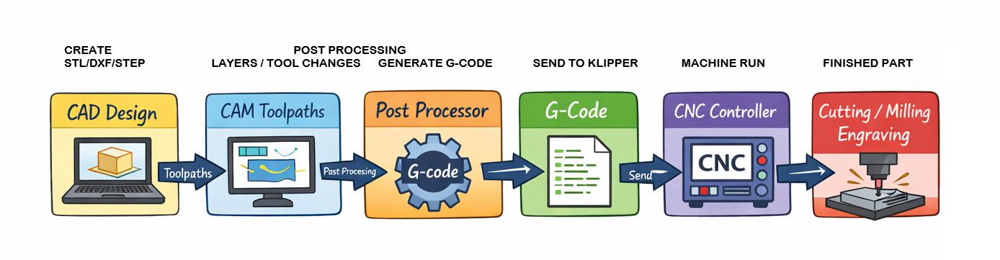

# What is a Post Processor?

A **post processor** is a software component that translates the toolpath information generated by your CAM software (like Fusion 360) into **G-code instructions** your CNC machine can understand. Think of it as the "interpreter" between your design and your machine’s motors.

Without the correct post processor, your CNC may **move incorrectly, ignore settings, or even crash**.

---

## How it Fits Into the Workflow

1. **Design**
   Create your part in CAD software (Fusion 360, FreeCAD, etc.). Define dimensions, shapes, and features.

2. **CAM (Computer-Aided Manufacturing)**
   Generate **toolpaths** for your part. Toolpaths include the cutting moves, speeds, feeds, and spindle operations.

3. **Post Processor**
   Convert the generic toolpaths into **machine-specific G-code**. This step ensures that your instructions match the firmware, kinematics, and hardware of your CNC.

   * Example: The **Klipperized post processor** adapts toolpaths to standard Klipper commands.
   * It handles nuances like:

     * G0/G1 rapid vs. linear moves
     * Motor steps and acceleration
     * Machine coordinates and offsets
     * Tool change commands (if applicable)

4. **CNC Controller**
   Load the generated G-code into your CNC controller (Mainsail, Fluidd, or other Klipper interfaces).
   The controller executes the commands, moving your machine precisely along the toolpaths.

5. **Cutting / Milling / Engraving**
   Watch your design come to life as the CNC follows the instructions accurately.

### Visual Workflow

---

## Why You Need the Right Post Processor

Every machine is slightly different: frame size, stepper drivers, firmware, and even how axes are defined can vary. The **post processor ensures your CAM output matches your hardware exactly**, avoiding crashes, misalignments, or wasted material.

### Key Benefits

* Prevents collisions and crashes
* Ensures accurate scaling and positioning
* Supports machine-specific features (like dual Y-axis in Ender3 CNC)
* Optimizes travel moves and feed rates for performance and longevity

!!! Tip
    Always simulate the G-code in your CNC software (like OctoPrint, Mainsail, or Fluidd) before running a real cut. Even with the right post processor, checking ensures safety and accuracy.

