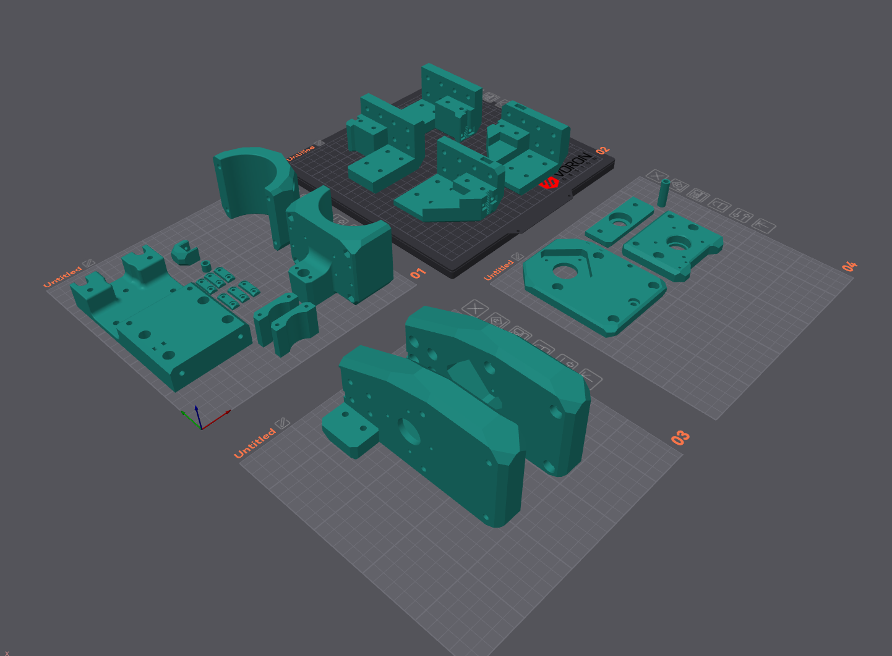
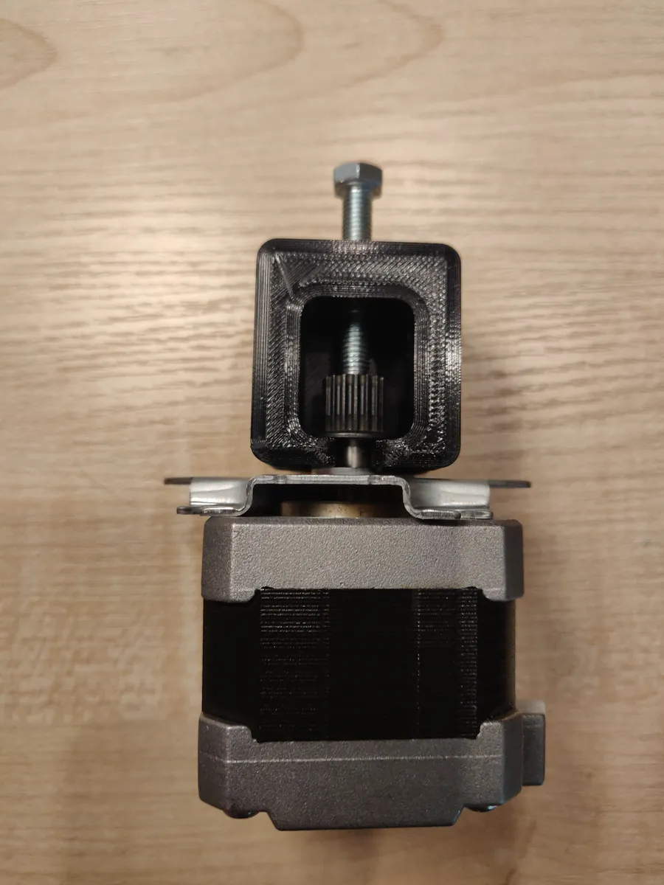
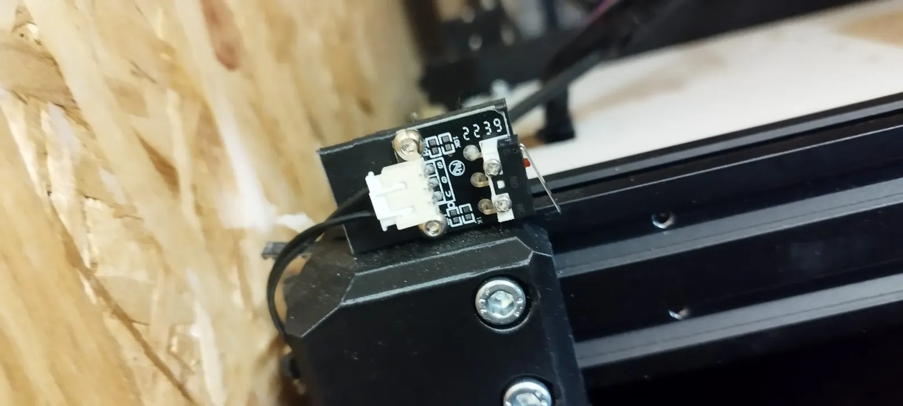
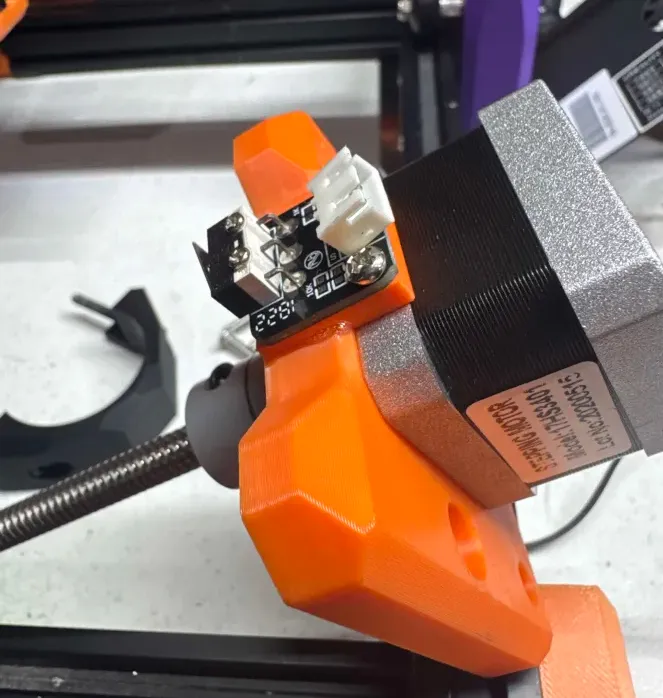
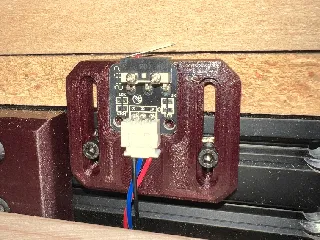
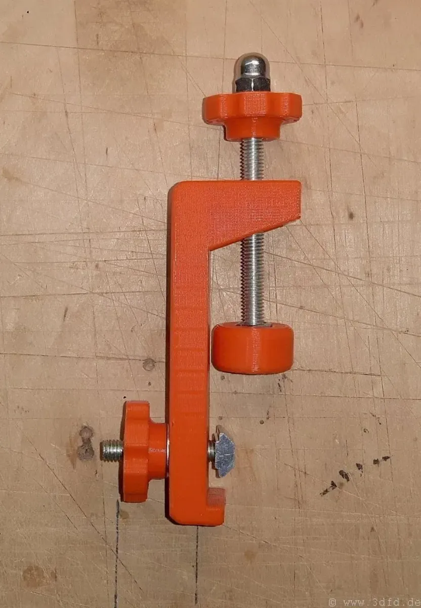
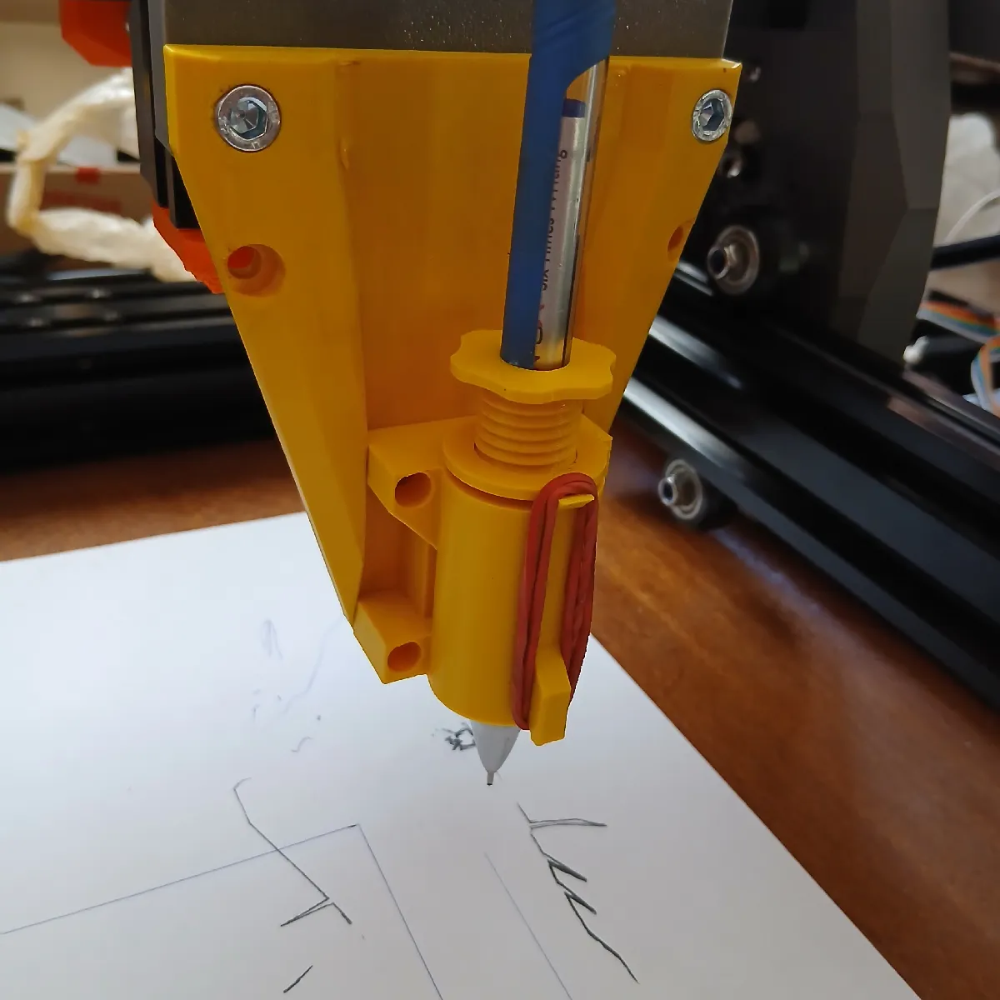
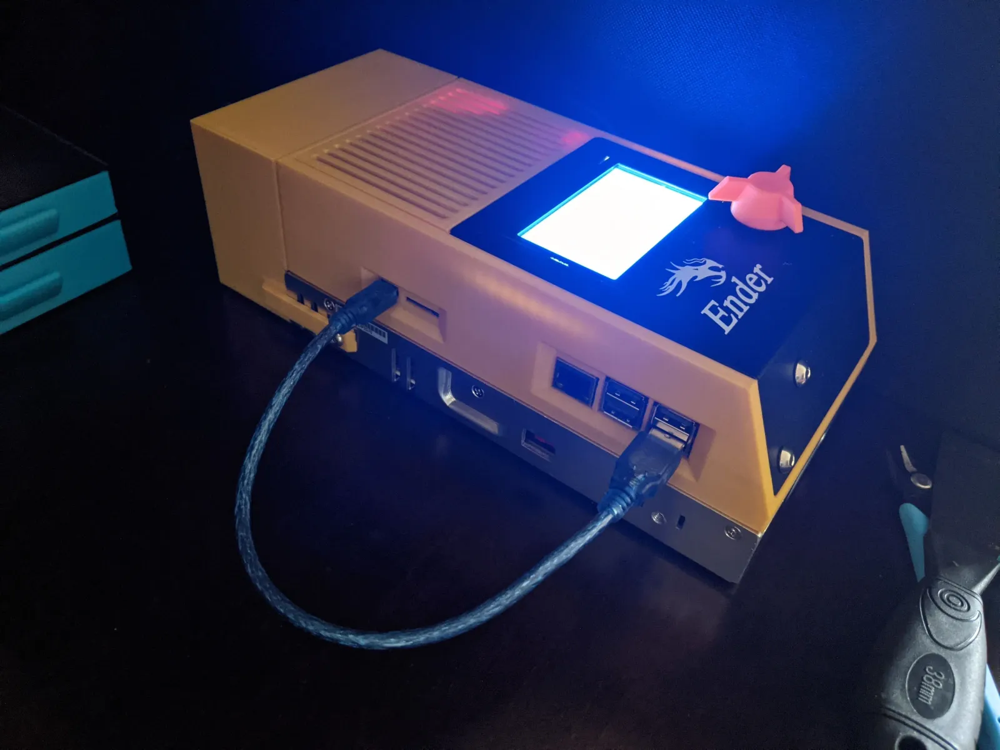

# 3D Printed Parts

## Print settings

* PLA
* 5 walls
* 5 top/bottom layers
* 40% gyroid infill
  

**Print orientation to avoid supports:**

## Other parts 

- Press-fit pulley
- Spacers
- Clamps
- Endstops
- Marker tool
- Z probe
- Electronics Enclosure

### [Pully Extractor](https://www.printables.com/model/230013-press-fit-pulley-extractor-for-nema-17)

### [X & Y Endstops](https://www.printables.com/model/1365912-e3cnc-belt-clamps-with-original-endstops)

### [Z Endstop](https://www.printables.com/model/1605131-e3cnc-z-endstop-mod)

### [Z probe](https://www.printables.com/model/1372537-e3cnc-limit-switch-z-probe-tool-height-sensor)

### [Clamps](https://www.printables.com/model/125781-clamp-holder-for-a-3018-cnc-milling-engraving-mach)

### [Pen holder](https://www.printables.com/model/1610808-e3cnc-pen-holder)

### [Electronics Enclosure](https://www.printables.com/model/226631-external-electronics-box-for-ender-3-pro)

