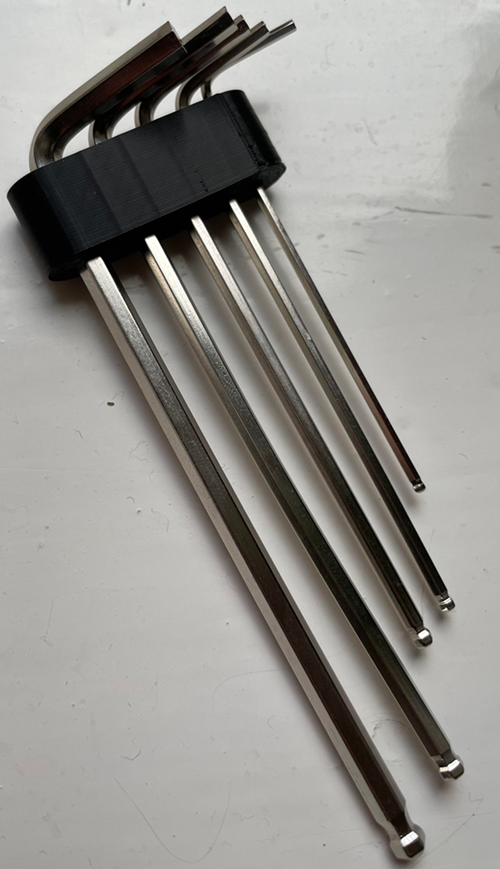
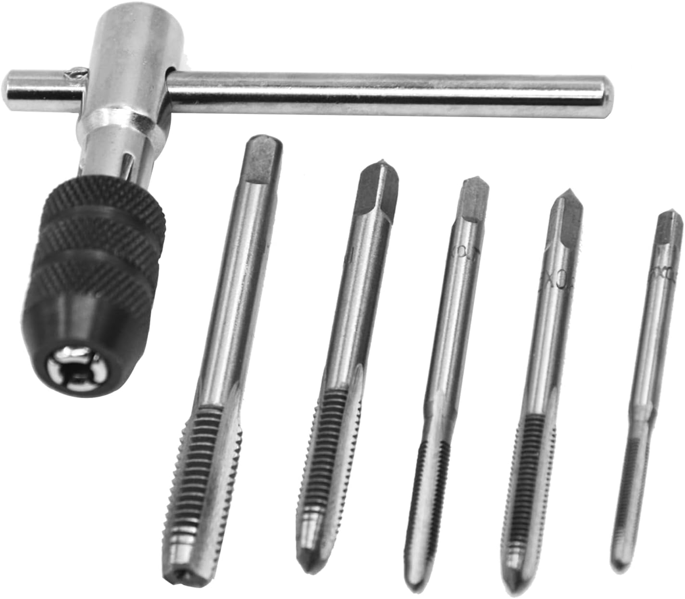
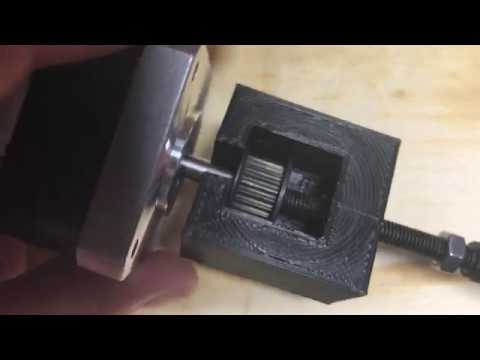
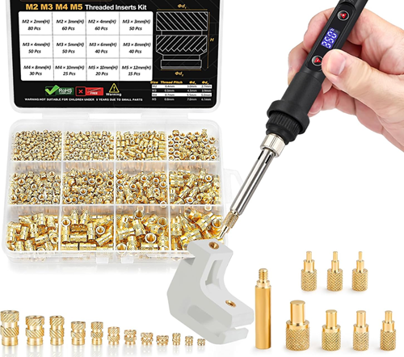
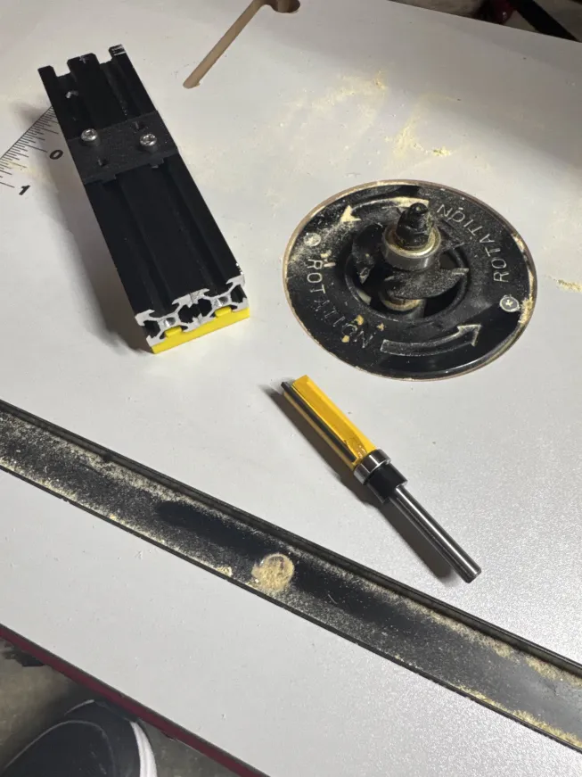

# Tools & Equipment Required

Before beginning the mechanical conversion, ensure you have the following tools and equipment available.

This build involves modifying aluminum extrusions, cutting threads, aligning structural components, and installing threaded inserts. Proper tools directly impact final rigidity and alignment accuracy.

---

## Core Requirements

* **Ability to cut, drill and tap aluminum extrusions**
  A miter saw with a non-ferrous blade, bandsaw, or hacksaw with fine tooth blade will work. Clean, square cuts are critical for frame alignment. We will go through this process.

* **Linux machine running Klipper (optional)**
    * Raspberry Pi (recommended), or
    * Old laptop running Ubuntu or similar
      Required only if using the Klipper control setup.

* **Spindle or Rotary Tool (Dremel-style)**
  Ensure compatibility with printed clamps before purchasing.
  Check mounting diameter and weight.

!!! tip "Recommended Approach"
    Perform frame assembly on a flat, rigid surface.
    Surface flatness directly affects squareness and long-term dimensional accuracy.

---

## Tools

| Tool                     | Purpose                        |
| ------------------------ | ------------------------------ |
| Hex Drivers (Allen keys) | Assembly and frame tightening  |
| M5 Tap                   | Cutting extrusion end threads  |
| Drill + Bits             | Blind joint access holes       |
| Blind Joint Drilling Jig | Ensures correct hole placement |
| Pulley Extraction Tool   | Removing press-fit pulleys     |
| Heat Set Insert Tool     | Installing threaded inserts    |
| Machinist Square         | Ensuring frame alignment       |
| Hack saw or Band saw     | Cutting Z rail extrusion mount |

---

### Hex Drivers
Most builders received these with their Ender 3. These are not the highest quality and may round off if not careful. 

!!! tip
    For improved ergonomics and torque control, consider printed handles such as: [Hex Key EZ handles](https://www.printables.com/model/966972-hex-key-ez-handles)

## M5 Tap

Used to cut internal threads in aluminum extrusion ends.

Recommendations:

* Use proper cutting oil (e.g., Tap Magic or similar)
* Advance slowly and back out periodically to clear chips
* Clean the tap between holes
* Keep the tap perpendicular to prevent cross-threading

!!! tip
    Thread alignment directly affects joint strength and frame squareness.

## Drill for Blind Joints

Blind joints allow you to secure two extrusions without drilling completely through both members.

You will drill an access hole that allows a hex driver to reach the internal fastener.

!!! tip "Ensuring correct placement and consistent results"
    [2020 Extrusion Blind Joint Drilling Jig](https://www.printables.com/model/815359-2020-extrusion-blind-joint-drilling-jig)

Accuracy here prevents misalignment and frame twist.

---

## Pulley Extraction Tool

Stepper motor pulleys are often press-fit and difficult to remove without damage.

If you do not have a pulley puller, you can print a [Pulley Extractor](https://www.printables.com/model/230013-press-fit-pulley-extractor-for-nema-17) or cut them off (not recommended).

!!! tip
    Avoid prying against the motor housing — this can permanently damage bearings.

---

## Heat Set Insert Tool

A soldering iron with appropriate tip is required for installing heat set threaded inserts into printed components.

Best practices:

* Use temperature appropriate for insert size
* Apply steady downward pressure
* Ensure insert is perpendicular during insertion
* Allow part to cool fully before applying torque

Proper insert installation significantly improves mechanical durability.

## Saw

The stock Ender 3 top horizontal extrusion will be cut and repurposed to form the dual Z-axis vertical rails.

* Miter saw with non-ferrous blade (preferred)
* Bandsaw with fine-tooth blade
* Hacksaw (acceptable with care)

!! Tip "Making ends square"
    Use a router to make sure ends of extrusion are square and the same length.

---

## Optional but Recommended

* Metric ruler (for verifying cut lengths)
* Thread locker (medium strength)
* Deburring tool or file
* Clamps (for holding extrusions during drilling)
* Dial indicator (for bed leveling and advanced alignment verification)

---

## Ready to Proceed?

Once you have the required tools, continue to the next section to review required hardware and printed parts.

  <a href="/EnderCNC/hardware" class="md-button md-button--primary">
    Continue to Hardware & BOM →
  </a>

---

